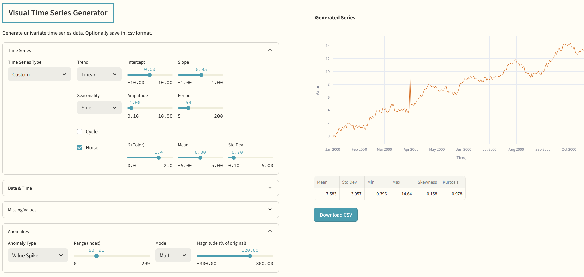

  

# Visual Time Series Generator

This repository contains the code for a Streamlit app that generates univariate time series data. It's designed for visual experimentation, teaching, and simulation. The app supports multiple structural components such as trend and seasonality, as well as missing values.

**Features**
- Interactive controls for several types of time series
- CSV export for generated series
- Dynamic plot and summary stats

**Series Types**
- Noise
- Ornstein–Uhlenbeck (OU) process, also known as mean-reverting Gaussian process
- Custom Series (combine trend, seasonality, cycle, and noise)

## How It Works

You can choose from predefined series types or build a custom one. For custom series, you can:

- Select a trend shape (linear, quadratic, exponential)
- Choose a seasonal pattern (sine, sawtooth)
- Add a cyclical component with decay
- Add colored noise with adjustable parameters

The app then generates and plots the resulting time series. You can export it for use in modeling, testing, or teaching.
