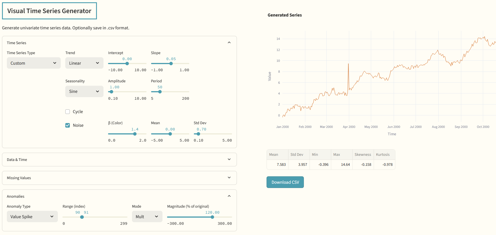

  

# Visual Time Series Generator

This repository contains the code for a Streamlit app that generates univariate time series data. It's designed for visual experimentation, teaching, and simulation. 

The app supports multiple structural components such as noise, trend and seasonality, as well as missing values and anomalies.

**Features**
- Interactive controls for several types of time series
- Controls for missing values and anomalies
- Dynamic plot and summary stats
- CSV export for generated series

**Series Types**
- Noise with adjustable β (color)
- Ornstein–Uhlenbeck (OU) process, also known as mean-reverting Gaussian process
- Custom Series (combine trend, seasonality, cycle, and noise)

## How It Works

- Choose from predefined series types or build a custom one (for custom series, you can select a trend, seasonality, cycle, and noise).

- Set data parameters like number of points, random seeds, and interval.

- Optionally add missing values and anomalies.

- The app then generates and plots the resulting time series.

- The data is re-plotted each time any parameter is adjusted.

- You can also export the data as a .csv file.
